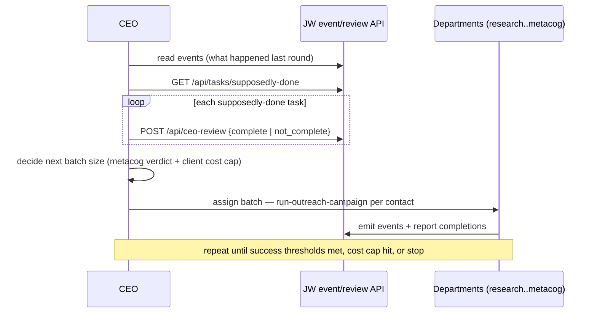

# Rule 01 — Departments (the org that runs the skills)

**Dir this governs:** `~/avi-jw/agents/`. The CEO (`agents/CEO.md`, an SDK
`ClaudePMainAgent`) bootstraps a JW instance and assigns work to departments.
Each department is one manager agent; workers run the `outreach-*` skills against
the active `$client`. This is the JW instance side of the worker-layer
architecture (`00-WORKER-LAYER-ARCHITECTURE.md`).

## The five departments (one agent each)

| dept agent | owns stage | runs skill(s) | connector verbs |
|---|---|---|---|
| `research` | source leads | `outreach-source` | `jwout pull` |
| `content` | write copy | `outreach-write` | *(none — instruction)* |
| `production` | make + host teaser | `outreach-teaser` | `jwout video`, `jwout host` |
| `delivery` | send + replies | `outreach-deliver`, `outreach-replies` | `jwout send`, `jwout reply`, `jwout track event` |
| `metacog` | measure + judge | `outreach-report` | `jwout track report` |

## Org / flow

```mermaid
flowchart TB
  AVI[Avi / client] --> CEO
  CEO --> RES[research]; CEO --> CON[content]; CEO --> PRO[production]
  CEO --> DEL[delivery]; CEO --> MET[metacog]
  RES -->|contacts| CON -->|copy| PRO -->|teaser URL| DEL
  DEL -->|reply/booked events| MET -->|verdict + recommend| CEO
  classDef m fill:#48f,color:#fff; class CEO m
```

## Per-contact pipeline (who does what, in order)

```mermaid
sequenceDiagram
  participant CEO
  participant RES as research
  participant CON as content
  participant PRO as production
  participant DEL as delivery
  participant MET as metacog
  CEO->>RES: source N leads for $client
  RES-->>CON: deduped contacts in JWOUT_DB
  CON-->>PRO: copy.txt (+ vprompt.txt if video)
  PRO-->>DEL: hosted teaser URL
  DEL->>DEL: jwout send ; capture send_id
  DEL->>MET: reply/booked events (via outreach-replies)
  MET-->>CEO: funnel + verdict vs success thresholds
```

## CEO round + review loop (the orchestration execution boundary)

`run-outreach-campaign` runs inside the JW round/review loop the CEO already
owns (`ceo-bootstrap`): assign work, let departments execute, review what they
report as done, decide the next batch.



## Rules every department agent obeys

- One client at a time: read `JW_CLIENT` / `JW_CLIENT_DIR`; never hard-code content.
- Respect every `NEEDS-FROM-<client>` gate — do not run a live send while a
  required client field is null.
- The one law: only the connector executes; everything else is instruction.
- Report events to the JW event stream (`jobworld-report-event`) so the CEO and
  the SOP engine can see the run.
