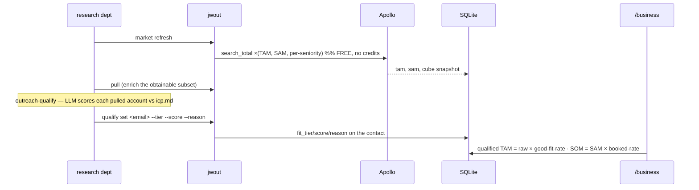

# Rule 04 — Market Mapping (TAM/SAM/SOM the modern way)

How avi-jw sizes a market, distilled from current GTM-engineering practice
(2025–2026). Governs `connectors/outreach` `market`/`qualify`, the `outreach-qualify`
skill, the client `icp.md`, and the dashboard `/business` view.

## The thesis (what changed)

**TAM is no longer a dollar figure from an analyst report. It is an enumerable,
*scored* list of real companies.** AI sits in the **qualification** layer, not the
arithmetic. The bottom-up formula is unchanged — `count(qualifying accounts) × ACV`
— but LLMs made per-account ICP qualification cheap enough to *score the whole set*
instead of estimating it. "We'll capture 1% of a $300B market" is now a vanity tell.

A raw search-tool count (Apollo `total_entries`) is a **recognized but upper-bound**
TAM proxy — it over-states (dupes, dead records, parent/sub misattribution;
firmographics are modeled estimates, ~50% accurate, decay ~30%/yr). So the count is
the cheap primitive; the **qualified** count is the real TAM.

## How avi-jw does it (the bijection holds)

| GENERAL | SPECIFIC (B6) | CODE |
|---|---|---|
| size the market | ICP targeting filters | `jwout market refresh` → free Apollo `search_total` (TAM, SAM, + per-seniority cube) |
| qualify the market | `clients/b6/icp.md` rubric | *(none — the LLM scores via `outreach-qualify`)* |
| store the score | — | `jwout qualify set <email> --tier --score --reason` |
| value + show it | `economics.avg_deal_value_usd` | `dashboard /business` (qualified TAM = raw × fit-rate) |

- **The rubric is client config** (`icp.md`) — instruction. **The scoring is the LLM**
  (`outreach-qualify`) — instruction. **The count, the storage, the rate are code**
  (the connector). Same law as everywhere: only external-effect/state is code.
- **Qualified TAM = raw Apollo count × good-fit rate** (the fraction of the *pulled,
  scored* sample in tier A/B). It is an estimate that **sharpens as more accounts are
  scored** — the raw count is the ceiling, the rate pulls it down to reality.
- **SOM = SAM × the live booked-rate** (observed conversion from the funnel). The
  public literature *asserts* this loop but rarely formalizes it; we compute it live —
  this is a place we are ahead, not behind. Keep it.

## Flow

## Pitfalls baked into `icp.md` and the skill (how this goes wrong)

- **Additive, never multiplicative** scoring (multiplicative → dead zones + fake-perfect).
- **"Size counted five times"** — revenue/headcount/big-brand co-vary; don't let three
  proxies for bigness masquerade as three criteria.
- **Missing data ≠ poor fit.** Unknown firmographic → review (tier C), never a confident 0.
- **Treat AI-inferred firmographics as untrusted** — say what was inferred in the reason;
  never fabricate a revenue figure or campaign. The reason is the audit trail.
- **Validate the rubric against closed-won every cycle** — if your best customers don't
  land in tier A/B, the rubric is wrong, full stop.
- **Count-first, enrich-the-subset.** `search_total` is free; only spend enrich credits
  on the obtainable, qualified subset.

## Honest gaps (not built — would be the next real steps)

- Cross-checking the Apollo count against an **independent denominator** (Census CBP /
  TheCompaniesAPI `/count`) to report TAM as a *range* — Apollo alone over-counts.
- A **two-table accounts ⟂ contacts** split (enrich once per domain) for cost at scale.
- **Batches API (Haiku)** bulk-scoring of the whole pulled universe (~$5 / 10k) before
  the Sonnet deep-research pass. These are scale optimizations, deferred until there's
  volume — same "production-later" discipline as the WSGI note.

## Sources

Stage 2 Capital (AI account-selection agent), Clay TAM-sourcing, Garrett Wolfe's GTME
"problem of the week" (the scoring-pitfalls source), Databar / RevEngine "Claude 301",
Apollo's own data-accuracy doc, Census County Business Patterns. Full URLs: the
five-agent research synthesis in the session transcript that produced this rule.
