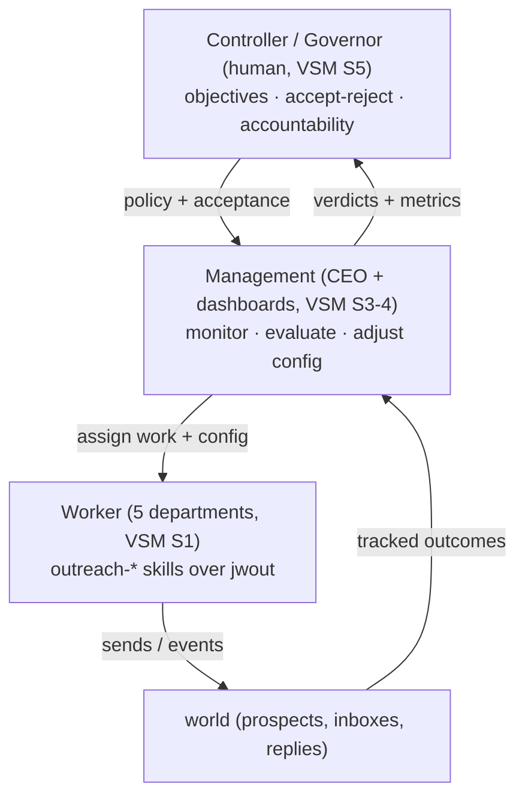
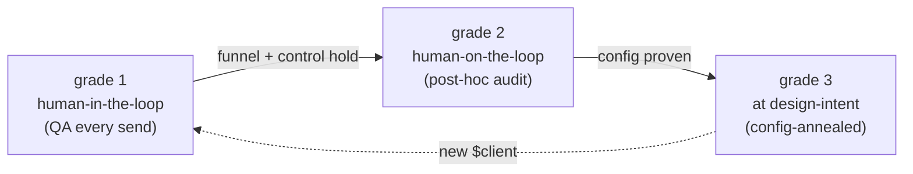
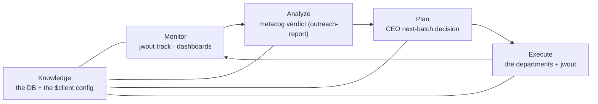

# Rule 05 — Autonomy Bridge (avi-jw ↔ the autonomy framework)

**What this is.** avi-jw is not just an outreach product; it is a **worked
instance of the autonomy framework** (`~/autonomy-framework/`). The framework is
the general theory of self-adaptive agent-organizations; avi-jw + a `$client` is
*one application* of it. By the framework's **non-transferability principle**, that
separation is the point — the theory is the general thing, each venture (B6, the
next client) is a graded instance. This rule maps our concrete parts to the
framework's mechanism terms so the build and the theory stay legible to each other.

> Canon: `~/autonomy-framework/AUTONOMY-MANIFESTO.md` (Part II.2 the triad, II.3 the
> ladder, A3.3 grades-are-handlers, A4 theory-vs-code), `LORE-MECHANISM-GLOSSARY.md`
> (the term↔mechanism table), `ACADEMIC-DISCOURSE-MAP.md` (the MAPE-K framing).

---

## 1. The keystone identity: the law **is** the worker-binding spectrum

The one law of this codebase — *"a thing is code only if it MUST execute; everything
else is an instruction to the LLM"* (`00-WORKER-LAYER-ARCHITECTURE.md`,
[[the-functions-vs-instructions-law]]) — is the framework's **worker-binding
spectrum** (glossary: *"free agent reasoning → procedure skill → deterministic
function… progressively bind until it's a function"*). They are the same statement.

```mermaid
flowchart LR
  A["free agent reasoning<br/>(minimally bound)"] --> B["procedure skill<br/>(partially-evaluated LLM call)"] --> C["deterministic function<br/>(fully bound, external effect)"]
  A -. avi-jw .-> A2["outreach-write / outreach-qualify<br/>(the LLM generates / scores)"]
  B -. avi-jw .-> B2["the outreach-* skills<br/>(bound to template + $client config)"]
  C -. avi-jw .-> C2["jwout connector verbs<br/>pull · send · track · serve …"]
  classDef m fill:#1b4,color:#fff; class C,C2 m
```

- **Free end** = the LLM writing copy / scoring ICP — bound only by instructions.
- **Middle** = the `outreach-*` skills = *partially-evaluated LLM calls* (Futamura
  `mix` specializing the model w.r.t. a fixed template + the client config);
  reliability comes from the **bound**, not the model's cleverness.
- **Right end** = the `jwout` verbs = fully bound, external-effect **functions** — "code
  only if it MUST execute" is exactly *"bind all the way to a function."*
- **Annealing = sliding rightward** as a step proves invariant (the connector exists
  because sending/tracking are already fully bound; a copy rule stays an instruction
  because it is not). Model routing falls out: connectors (no model) · skills +
  generation (model). That is why the law produces a connector + skills + a config.

---

## 2. The triad — Worker / Management / Controller (VSM S1 / S3–4 / S5)

Manifesto II.2: the plant, the supervisory controller, the governor.

| framework role | mechanism | avi-jw |
|---|---|---|
| **Worker System** | the *plant*; operations — VSM System 1 | the five departments (`research · content · production · delivery · metacog`) running the `outreach-*` skills — agent steps + deterministic `jwout` steps composing the campaign SOP |
| **Management System** | the *supervisory controller* (Sheridan); adaptation — VSM Systems 3–4 | the **CEO** (`run-outreach-campaign` + the `ceo-bootstrap` review loop) **+ the dashboards** — observes execution, evaluates outcomes vs acceptance criteria (success thresholds, the gate panel), adjusts worker config (next batch size, variant, segment); runs the system stepwise |
| **Controller (human)** | the *governor / principal* — VSM System 5; governance, not management | **Avi / the client** — holds objectives (the SPEC, the ICP, success thresholds), accept/reject authority (the human QA gate on sends; final say on CEO reviews), and legal accountability (CAN-SPAM, domain reputation). Like shareholders to a public company, not a line manager. |



This is "Management System v0" from the manifesto (II, *Mapping onto what we are
building now*) — the draft→lint→revise loop plus config deltas after the governor's
verdicts — generalized into a full department org.

---

## 3. Grades, shields, and the oversight envelope

The send path is deliberately **grade 1** (human-in-the-loop, pre-execution gate):
the SPEC's non-negotiable that delivery is a human-QA-gated batch, never autonomous
agent action. The **shield** (oversight envelope) is the set of gates that contains
the engine while trust is established:

- config gates (`NEEDS-FROM-<client>`: warmed domains, calendar, dedupe, compliance)
- the deliver gates (`suppress check`, CAN-SPAM footer, `warmup_status: ready`, dedupe)
- the copy self-check (the LLM is the linter — an instruction, not code)
- dry-run-until-the-gates-clear

**Non-transferability:** a new client is a new shield-1 traversal — it enters at
grade 1 regardless of how proven the engine is, because *autonomy grades are
domain-specific and never transfer*. "B6 is just `$client`" is this principle in the
config layer.

**Annealing (staged trust promotion):** as the funnel and the §9 control prove out —
read live on the dashboard, logged in the review/verdict trail — supervision
"temperature" drops, per phase, reversibly:



config-annealing = a proven `$client` configuration graduates to a trusted "golden"
run. The new-client onboarding the agency sells *is* a fresh grade-1 traversal.

---

## 4. Gauge vs handler — `supposedly_done` was the theory before it was named

Glossary: **gauge** = internal self-assessment (fine for convergence/quality
detection, never for acceptance); **handler** = the external acceptance authority.
JobWorld's `supposedly_done` task state = *"gauge-passed, handler-pending"* — the JW
ontology encoded the distinction before the framework named it.

| | avi-jw |
|---|---|
| **gauge** (internal) | the LLM self-checking copy against the rules; the qualification scores; the dashboard funnel/metrics |
| **handler** (external) | the CEO review (`complete` / `not_complete` via the JW review API) → ultimately the human governor's QA on sends |

Rule that follows: **no trace → no handler → not annealable, only believable.** Every
gauge result must be reified (the tracking DB, the verdict log) so a handler — human
now, a learned acceptance model later — can accept it.

---

## 5. Observatory, provenance, process mining

The tracking layer (`sends`, `events`, `suppressions`, `market`, the verdict log) is
the framework's **observatory / recorder layer** (Amendment 2): the run describes
itself → **provenance**. JobWorld's **SOP engine** (it extrudes SOPs from the event
stream) is **process mining** — recovering the backward chain (the design/process)
from forward-chain records. That recorder layer is the mechanism that makes the next
shield rung (a *learned acceptance model* staffing the gates, Amendment 1/2) possible
at all.

---

## 6. Academic frame (say this to an engineer)

The whole thing is a **self-adaptive system with a MAPE-K loop under graded
human-on-the-loop oversight** (the framework's keystone, `ACADEMIC-DISCOURSE-MAP.md`):



And **amplification of regulation** (Ashby): one fixed-variety human governor
regulates an arbitrarily large outreach operation by delegating variety down the
hierarchy — governor → CEO → departments → connector verbs — with attention
granularity rising per-send → per-batch → per-policy → per-envelope as trust anneals.

---

## 7. What the theory demands that the code does NOT yet have (honest)

Per the manifesto's A4.4 build targets, the same gaps show up here:

- **The learned acceptance model / shield-2a handler is unbuilt.** The verdict log +
  the review trail are the seed corpus; nothing yet fits the governor's accept/reject
  history as an evaluator to staff later gates. This is the real "next rung."
- **The gauge is an instruction, not in-loop code** — by our law (the copy linter is
  the LLM, deliberately). The framework wants the gauge reified for annealing; we
  satisfy that not by building a string-linter (forbidden) but by **logging the
  verdict** (`jwout track` / the review log) so the handler has a trace.
- **No in-loop convergence detector** for "this config has stopped changing" — the
  dashboard shows the evidence; the promotion decision is still the governor's.

Keep this rule current as those rungs get built; cross-linked from the framework at
`~/autonomy-framework/` (which points back here as its first worked instance).
