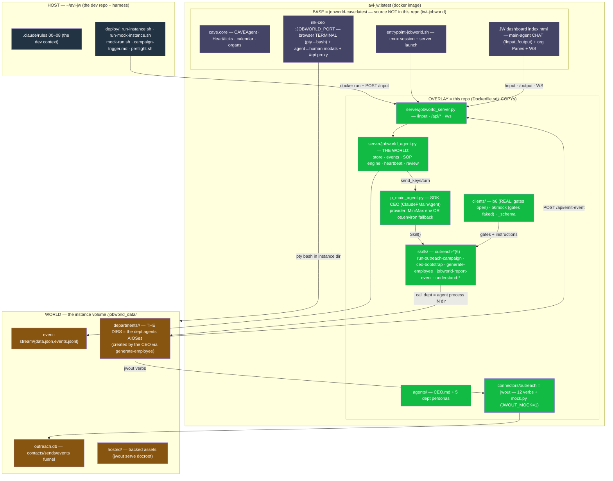

# Rule 07 — The Architecture (component diagram + where every flow lives)

The one-page structural truth of the whole system (rule-23 component diagram).
Every code dir carries its own `FLOWS.md` with the rule-22 sequence diagrams for
its execution boundaries — this rule is the map OVER those.

## The three systems (the test decomposition)

```
S1 CLIENT-STUFF  = clients/<c>/client.json gates + creds     → mock: clients/b6mock + JWOUT_MOCK=1
S2 AGENT SYSTEM  = CEO ⊕ departments(=DIRECTORIES) ⊕ rounds  → test NOW on the mock harness
S3 APPLICATION   = JW server + API + frontends + heartbeat   → test NOW
```

## Component diagram (the system, all boundaries)



## Ports (one instance)

| port | surface |
|---|---|
| `JOBWORLD_PORT` (8511 mock / 8501 default) | ink-ceo terminal + proxied dashboard |
| 3847 | python API (`/input`, `/api/*`, `/ws`, dashboard html) |
| 8000 | `jwout serve` — recipient-facing tracked links |
| 8787 (localhost) | `jwout dashboard` — operator funnel |

## Where every flow's sequence diagram lives (rule 22)

| dir | FLOWS.md covers |
|---|---|
| `server/FLOWS.md` | boot · /input turn · heartbeat · emit-event→task flip · ceo-review · SOP harvest |
| `skills/FLOWS.md` | FIRST BOOT · the round loop (CEO→departments→report→review) |
| `clients/FLOWS.md` | the gate check (open gates → blockers + GATES.md + delivery hold) |
| `connectors/outreach/FLOWS.md` | every non-trivial jwout verb (+ mock mode) |
| `deploy/FLOWS.md` | image build · production run · the mock harness run |
| `docker/FLOWS.md` | **the BASE boot (the tmux interactive-claude CEO — the original design)** · what the SDK overlay changes |
| `sop-engine/FLOWS.md` | SOP lifecycle: record → extrude → index/search → run (standalone Node; unwired) |

## Version markers (which archi is CURRENT)

- **CEO runtime:** `ClaudePMainAgent` (SDK, headless) = the MOCK/DEV harness mode.
  The tmux interactive CEO = the ORIGINAL BASE DESIGN and the intended PRODUCTION
  surface — `docker/entrypoint-jobworld.sh` launches `claude` (a real Anthropic
  model) IN the pane and the server drives that same pane (docker/FLOWS.md Flow 1).
  Under the SDK overlay that pane claude is ORPHANED (Flow 2). A provider/model
  switch (Sonnet 5 without MiniMax keys) is planned — see rule 08.
- **World creation:** the base entrypoint copies template files + skills + writes
  the CEO CLAUDE.md (fuller than previously documented); `template/…/start.sh`
  is the host-side equivalent. Remaining divergence: dept dirs (created by the
  CEO via generate-employee, not by either boot path).
- **SUPERSEDED:** nothing in this repo is dead code EXCEPT `sim/` (pointer only).
  `sop-engine/` is live-but-unwired (no consumer yet).
