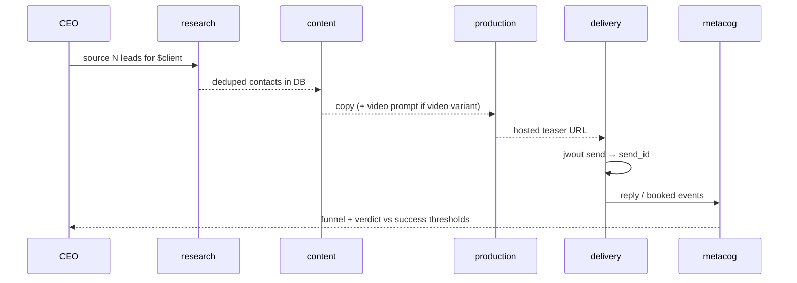

<div align="center">

# Avi-JW

**A JobWorld that runs cold outreach — and specializes to any client by config alone.**

A fork of [TWI JobWorld](#appendix--the-jobworld-base) whose CEO runs on the Claude Code SDK, plus a **worker layer** of connectors and skills that execute a full hyper-personalized outreach pipeline. The machine is universal. A client is pure configuration. *B6 is just `$client`.*

`SDK CEO` · `jwout` connector (11 verbs) · 7 stage skills · 5 departments · config-specialized clients

</div>

---

## The idea in one breath

A JobWorld is an AI company: a CEO agent coordinating department agents. This fork gives those agents a **real outreach capability** — source leads, write copy, generate a teaser, send, track, read replies, report — and makes the whole thing **specializable to any client by dropping config into named slots.** No code changes to onboard a client; you fill in a directory.

> ### The one law
> A thing is **code** only if it *must execute* something an LLM cannot do by emitting tokens — an external system, an external effect, or persisted state.
> **Everything else is an instruction handed to the LLM, not a function.**
>
> No string linter. No template filler. No "validate copy" gate. You tell the LLM the template; it fills and self-checks it. Code exists only for SMTP, HTTP APIs, IMAP, the DB, and file hosting.

---

## Architecture — three layers

```mermaid
flowchart TB
  subgraph client["clients/ — CONTENT (instructions + data)"]
    SCHEMA["_schema/ — the $client contract"]
    B6["b6/ — one instance"]
  end
  subgraph skill["skills/ — PROCEDURES"]
    RUN["run-outreach-campaign (CEO orchestration)"]
    STAGES["outreach-source · write · teaser · deliver · replies · report"]
  end
  subgraph conn["connectors/ — CODE (external effects only)"]
    OUT["outreach → jwout: pull · video · send · track · host · serve · dashboard · market · qualify · suppress · reply"]
  end
  subgraph ext["EXTERNAL SYSTEMS"]
    direction LR
    APOLLO["Apollo"]; MINIMAX["MiniMax"]; SMTP["SMTP"]; IMAP["IMAP"]; DB["(SQLite)"]
  end
  B6 -. read by .-> skill
  RUN --> STAGES --> OUT
  OUT --> APOLLO & MINIMAX & SMTP & IMAP & DB
  classDef code fill:#1b4,color:#fff; classDef content fill:#48f,color:#fff
  class conn,OUT code; class client,SCHEMA,B6 content
```

**The bijection** — every concept appears in all three columns, and the columns interlock. (The full set of 15 component & sequence diagrams lives in [`.claude/rules/`](.claude/rules) and [`connectors/outreach/FLOWS.md`](connectors/outreach/FLOWS.md).)

| GENERAL (the process) | SPECIFIC (B6 instance) | CODE (what executes) |
|---|---|---|
| source decision-makers | consumer $20M+, director+, those titles | `jwout pull` |
| write personalized copy | locked positioning + four-part anatomy | *(none — LLM applies instructions)* |
| make a teaser | show-world + product, navy/chartreuse | `jwout video` + `host` |
| deliver + record | warmed cold domains, cohorts | `jwout send` + `track` |
| read + classify replies | monitored inbox | `jwout reply` + `track` |
| measure | success thresholds, cost cap | `jwout track report` |

---

## The connector — `jwout`

The **only code** in the worker layer. Seven verbs, each one external effect. Credentials come from the environment; nothing client-specific is baked in.

| verb | external effect | status |
|---|---|---|
| `pull` | Apollo people search → contacts in DB (free search → paid enrich) | client real · needs key |
| `video` | MiniMax video gen (create → poll → download) | client real · needs key |
| `send` | deliver an email over SMTP, record the send | ✅ run-verified |
| `track` | write the DB; record events; funnel report by variant/cohort | ✅ run-verified |
| `host` | place an asset at a unique URL | ✅ run-verified |
| `serve` | serve assets (`view`/GET) + tracked `click` → 302 + `/u` one-click unsubscribe | ✅ run-verified |
| `dashboard` | read-view: `/` ops (funnel, pipeline, replies, gates) + `/business` exec (won/lost/potential, TAM→SAM→SOM, cost) | ✅ run-verified |
| `market` | `refresh` → TAM/SAM + seniority cube from free Apollo search totals (SOM live from booked-rate) | client real · needs key |
| `qualify` | `set`/`summary` — store LLM ICP fit scores → **qualified** TAM (raw count × fit-rate) | ✅ run-verified |
| `suppress` | opt-out list (CAN-SPAM): `add` / `check` (exit 2 if suppressed) | ✅ run-verified |
| `reply` | read replies over IMAP | client real · needs creds |

```bash
jwout pull --titles "CMO,VP Brand" --seniorities director,vp --status verified --limit 25
jwout video "9s teaser: <prompt>" --out teaser.mp4
jwout host teaser.mp4                         # → https://<host>/<uid>/teaser.mp4
jwout send --to a@b.com --subject "..." --body-file copy.txt --from cold1@dom --variant video
jwout track event <send_id> reply             # delivered|view|click|reply|booked|bounced
jwout track report --cost 0.50
jwout serve --port 8000                        # serves assets + records view/click
jwout reply --json
```

---

## Skills & departments

Six **stage skills** (procedures composing connector verbs with client instructions) and one **CEO orchestration** skill, mapped to five departments. Generative steps are pure instruction-application; deterministic steps are connector verbs.

| department | stage | skill | connector verbs |
|---|---|---|---|
| `research` | source leads | `outreach-source` | `pull` |
| `content` | write copy | `outreach-write` | *(none)* |
| `production` | make + host teaser | `outreach-teaser` | `video`, `host` |
| `delivery` | send + replies | `outreach-deliver`, `outreach-replies` | `send`, `reply`, `track` |
| `metacog` | measure + judge | `outreach-report` | `track report` |



---

## Specialize to a client = fill config

Onboarding a client adds **no code**. You create `clients/<name>/` to the [`clients/_schema`](clients/_schema) contract:

```
clients/<name>/
├── client.json      # structured params: targeting, sending.domains[], cohorts, costs, calendar
├── positioning.md   # locked positioning language (instruction)
├── template.md      # copy template + hard rules + cadence + signature (instruction)
├── assets.md        # proof links, approved facts, colors, world bible (instruction + data)
└── dedupe/          # exclusion lists (data)
```

Everything a client must provide is a **slot** — a string, number, file, secret, or object. Even a cold sending domain is a config object: `{domain, spf, dkim, dmarc, warmup_status, from_addresses[], daily_cap}` — "warmed" is just `warmup_status: ready`. That it costs money and weeks to reach `ready` is *acquisition cost*, not a different kind of thing (a paid API key is config too). **There is no client requirement that is not config.**

[`clients/b6`](clients/b6) is the worked example. See its [`README`](clients/b6/README.md) for the `NEEDS-FROM-AVI` slots still to be filled.

---

## Quickstart

```bash
# 1. Build the image (base + SDK CEO + worker layer; installs jwout + jq)
docker build -f Dockerfile.sdk -t avi-jw:latest .

# 2. (optional) provide a client's credentials
cp deploy/secrets.example.env deploy/secrets.b6.env   # then fill it

# 3. Run an instance for a client (runs dry without secrets)
deploy/run-instance.sh b6                      # JW dashboard :8501 · outreach dashboard :8787 · API :3847 · serve :8000

# 4. Drive it: the CEO uses run-outreach-campaign to orchestrate the departments
#    Watch the campaign at the outreach dashboard: http://localhost:8787
```

Local connector dev (no Docker):

```bash
cd connectors/outreach && python3 -m venv .venv && .venv/bin/pip install -e .
.venv/bin/jwout --help
```

---

## Repository map

| path | what | rule / doc |
|---|---|---|
| [`connectors/outreach`](connectors/outreach) | the `jwout` connector (CODE) | [`README`](connectors/outreach/README.md) · [`FLOWS`](connectors/outreach/FLOWS.md) |
| [`skills/outreach-*`](skills) · `run-outreach-campaign` | worker procedures | [`_OUTREACH-SKILLS.md`](skills/_OUTREACH-SKILLS.md) |
| [`clients/_schema`](clients/_schema) · [`clients/b6`](clients/b6) | `$client` configs (CONTENT) | [`clients/README`](clients/README.md) |
| [`agents`](agents) | CEO + 5 department agents | [`01-DEPARTMENTS`](.claude/rules/01-DEPARTMENTS.md) |
| [`server`](server) · `p_main_agent.py` | SDK-CEO JW server (the swap) | — |
| [`Dockerfile.sdk`](Dockerfile.sdk) · [`deploy`](deploy) | image + run scripts | [`02-DEPLOYMENT`](.claude/rules/02-DEPLOYMENT.md) |

---

## Status

Branch `worker-layer`. The worker layer is **complete and verified to the ceiling of what's possible without external inputs**:

- ✅ Image builds; `jwout`, `jq`, clients, agents, and all skills verified **in-container**.
- ✅ `host`, `send`, `track`, `serve` run-verified (incl. an end-to-end pipeline dry-run with the B6 config).
- ⏳ `pull`, `video`, `reply` are real clients gated on credentials.
- ⏳ Live B6 send gated on `NEEDS-FROM-AVI` config (warmed domains, calendar, dedupe lists, …).

Every remaining item is a **config value or credential** — none requires new code. Full matrix: [`.claude/rules/03-STATUS.md`](.claude/rules/03-STATUS.md).

---

## Docs

| doc | covers |
|---|---|
| [`00-WORKER-LAYER-ARCHITECTURE`](.claude/rules/00-WORKER-LAYER-ARCHITECTURE.md) | the law, three layers, bijection, component diagram |
| [`01-DEPARTMENTS`](.claude/rules/01-DEPARTMENTS.md) | the org, per-contact flow, CEO review loop |
| [`02-DEPLOYMENT`](.claude/rules/02-DEPLOYMENT.md) | image build chain, entrypoint boot, runtime env |
| [`03-STATUS`](.claude/rules/03-STATUS.md) | what's verified, the ready-for-any-answer matrix |
| [`connectors/outreach/FLOWS`](connectors/outreach/FLOWS.md) | connector module diagram + a sequence per verb |

---

<details>
<summary><h2>Appendix — the JobWorld base</h2></summary>

Avi-JW is built on **TWI JobWorld**: instantiate an AI-powered company that runs itself, coordinated by a CEO agent.

- **Web dashboard** at `http://localhost:{port}` — metrics, project tree, org chart, event log, day simulation.
- **Project hierarchy** — Projects → Milestones → Goals → Tasks.
- **CEO review loop** — agents mark tasks `supposedly_done`; the CEO confirms or sends back.
- **Event stream + SOP engine** — every action logged; repeated patterns crystallize into SOPs.

The base CEO bootstrap (`instantiate-jobworld`, `ceo-bootstrap`) still works as before; the worker layer adds `run-outreach-campaign` on top.

**Futamura projection** — this plugin is P1 in the tower: P0 = JobWorld source; **P1 = this plugin** (interprets source → new instances); P2 = `understand-plugins`; P3 = a meta-system that generates plugin-compilers.

</details>
