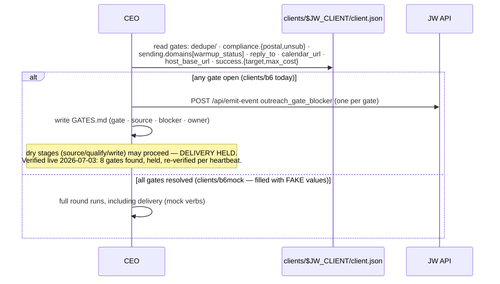

# `clients/` — the gate flow (rule 22)

A client dir is S1: the contract. `client.json` gates are DATA the CEO cannot
wish away — this is what makes the autonomy safe to sell.

## Flow — gate check (every round, before any delivery)

## The mock client (b6mock)

`b6mock` = b6's shape with every gate LOUDLY faked (`*.example` domains,
mock postal, localhost host_base_url). `trashed.csv` deliberately contains
`drsquatch.com` so a correct source run VISIBLY excludes the Dr. Squatch mock
contact — dedupe is asserted, not assumed. Never point live creds at it
(`env_profile=mock`).
