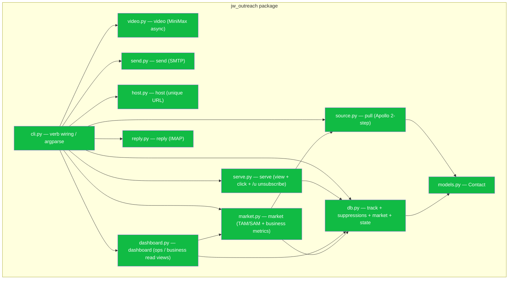
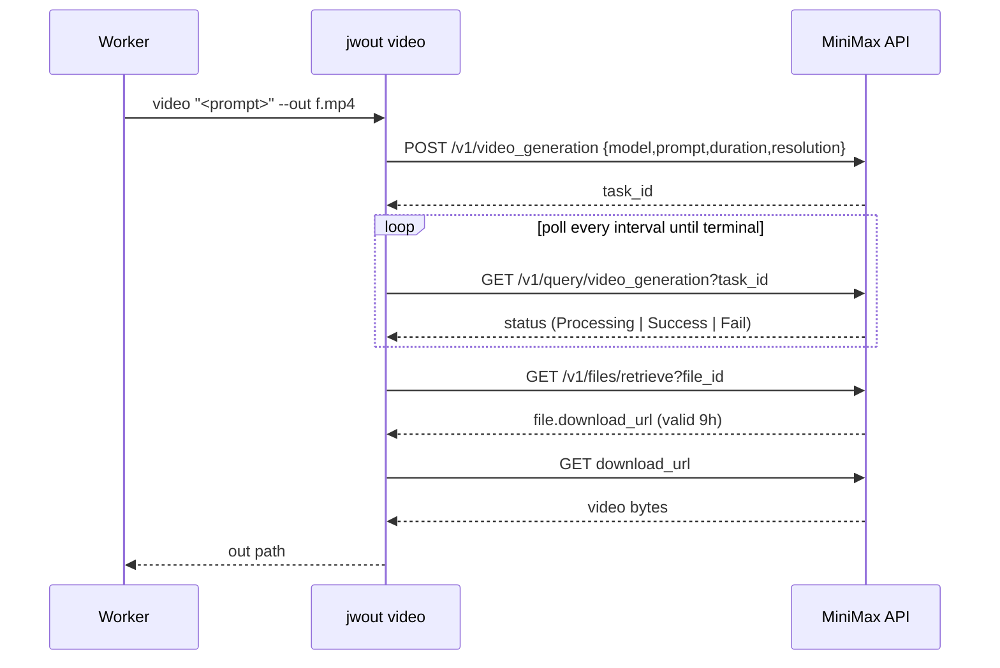
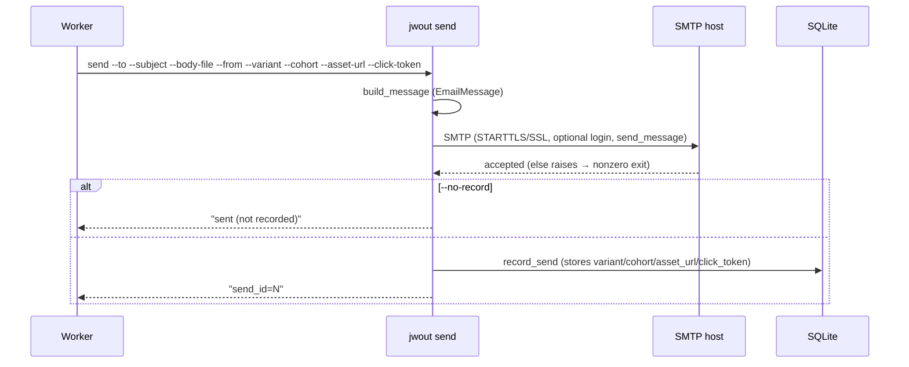
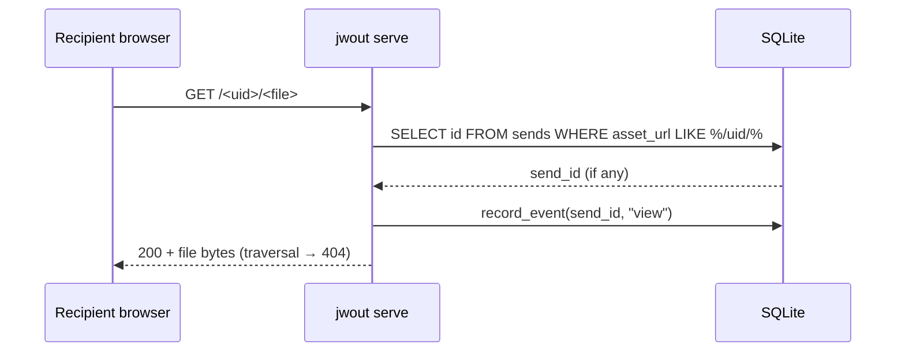
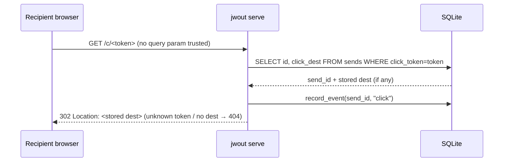
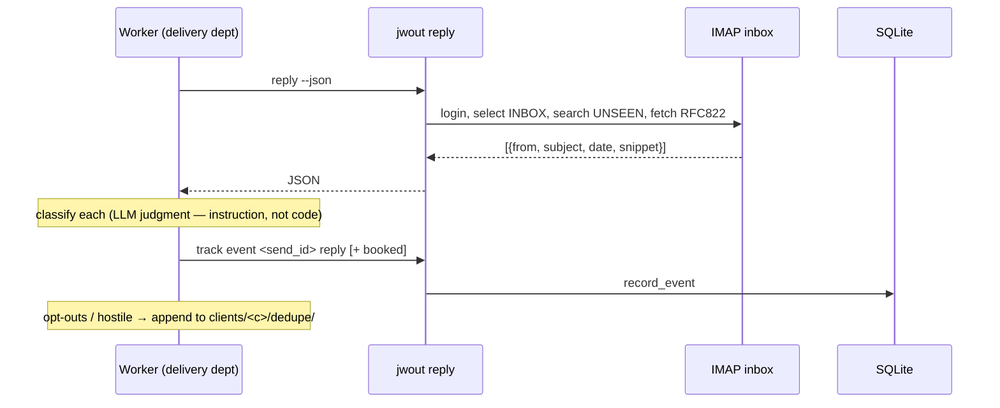

# `connectors/outreach` — component + execution-boundary flows

The internal structure of the `jwout` package and a sequence diagram for every
non-trivial verb boundary. (Trivial verbs — `host` = copy file → return URL;
`track event` = one INSERT; `track report` = one SELECT — are covered by the
data-flow diagram in `README.md` and need no sequence.)

## Component diagram (module dependencies)



`send`, `host`, `video`, `reply` have no internal deps (stdlib/requests only);
`serve` and `dashboard` reach state through `db` (serve is recipient-facing on
the public host; dashboard is operator-facing on localhost); `market` sizes TAM/SAM
via `source` (free Apollo) and is read by `dashboard`'s business view; `source`
and `db` share the `Contact` shape.

## `market refresh` — TAM/SAM sizing boundary (free)

```mermaid
sequenceDiagram
  participant W as Operator
  participant CLI as jwout market refresh
  participant AP as Apollo
  participant DB as SQLite
  W->>CLI: market refresh (reads $client targeting)
  CLI->>AP: search_total(titles+seniorities)         %% TAM — all ICP decision-makers
  AP-->>CLI: pagination.total_entries (FREE, no credits)
  CLI->>AP: search_total(+ verified email status)    %% SAM — reachable subset
  AP-->>CLI: total_entries
  CLI->>DB: record_market(tam, sam)
  Note over DB: dashboard /business reads the snapshot; SOM = SAM × live booked-rate (sharpens with data)
```

## `pull` — Apollo two-step execution boundary

```mermaid
sequenceDiagram
  participant W as Worker
  participant CLI as jwout pull
  participant AP as Apollo
  participant DB as SQLite
  W->>CLI: pull --titles.. --seniorities.. --status.. [--no-enrich]
  CLI->>AP: POST /mixed_people/api_search (filters)
  AP-->>CLI: person stubs (NO email) — FREE
  alt --no-enrich (preview)
    CLI-->>W: print matches (NOT saved; empty email is the PK)
  else enrich
    loop batches of 10
      CLI->>AP: POST /people/bulk_match (details[])
      AP-->>CLI: matches (email) — 1 credit per matched record
    end
    CLI->>DB: save_contact per matched person
    CLI-->>W: "pulled + enriched: N contacts"
  end
```

## `video` — MiniMax async create/poll/download boundary



## `send` — build → SMTP → record boundary



## `serve` view — GET asset → record view boundary



## `serve` click — tracked link → record click → redirect boundary



## `serve` /u + `suppress` — opt-out boundary (CAN-SPAM)

```mermaid
sequenceDiagram
  participant R as Recipient browser
  participant SV as jwout serve
  participant DB as SQLite
  R->>SV: GET /u/<token>   (one-click unsubscribe from the footer)
  SV->>DB: SELECT to_email FROM sends WHERE unsub_token=token
  DB-->>SV: email (if any)
  SV->>DB: INSERT suppressions(email, reason=unsubscribe)
  SV-->>R: 200 "You're unsubscribed" (page shown even for unknown token — no leak)
  Note over DB: deliver gate runs `jwout suppress check <email>` (exit 2 = skip);<br/>replies skill runs `jwout suppress add` for "remove me" / hostile
```

## `reply` — IMAP read → classify → track boundary


