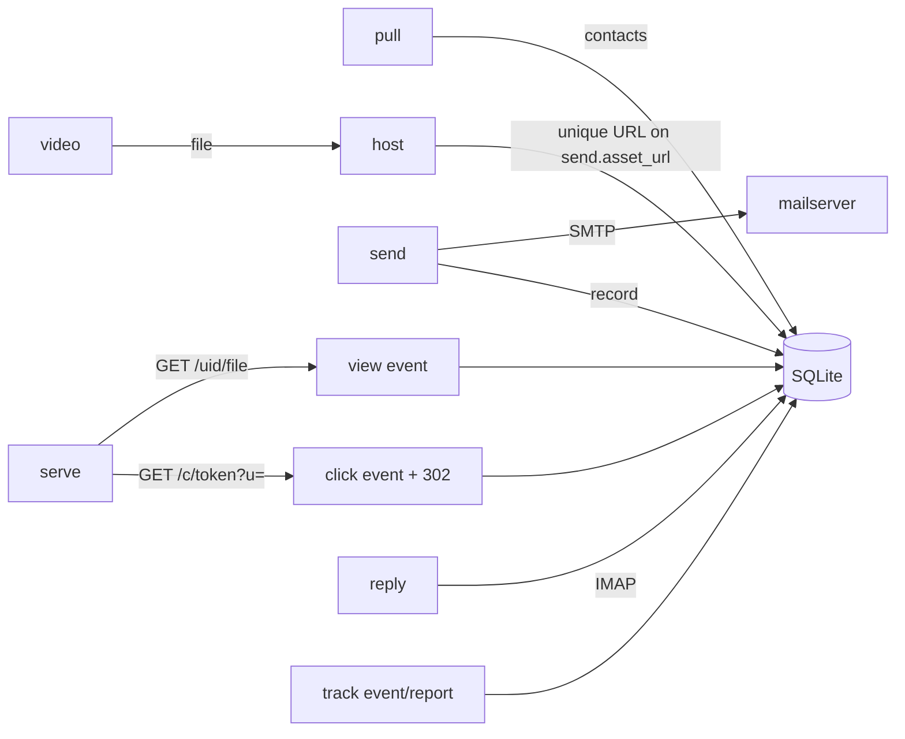

# `connectors/outreach` — the `jwout` connector

The universal outreach connector. Eleven external-effect verbs and nothing else.
No copy logic, no rules engine, no templates — those are instructions the LLM
applies from a `clients/` config. (See `../../.claude/rules/00-WORKER-LAYER-ARCHITECTURE.md`.)

## Install

```bash
cd connectors/outreach && python3 -m venv .venv && .venv/bin/pip install -e .
# gives the `jwout` console script
```

## The eleven verbs

| verb | external effect | key env vars | run-verified? |
|---|---|---|---|
| `pull` | Apollo people search → contacts in DB | `APOLLO_API_KEY` | client real; needs key |
| `video` | MiniMax video gen (create→poll→download) | `MINIMAX_API_KEY`, `MINIMAX_BASE_URL`, `MINIMAX_VIDEO_MODEL` | client real; needs key |
| `send` | SMTP delivery | `SMTP_HOST/PORT/USER/PASS`, `SMTP_STARTTLS` | ✅ ran against local SMTP |
| `track` | write DB; record events; report | `JWOUT_DB` | ✅ ran (event + report) |
| `host` | copy asset to unique served path → URL | `HOST_DIR`, `HOST_BASE_URL` | ✅ ran (file placed, URL returned) |
| `serve` | HTTP-serve assets (`view`/GET) + tracked-link `click` redirect (stored dest) + `/u/<token>` one-click unsubscribe | `HOST_DIR`, `JWOUT_DB` | ✅ ran (serve+view; click→302; traversal 404; /u→suppress+200) |
| `dashboard` | read-view, two pages: `/` ops (funnel/contacts/replies/gates) + `/business` exec (won/lost/potential, TAM→SAM→SOM, cost, revenue stub); localhost | `JWOUT_DB`, `JW_CLIENT_DIR` | ✅ ran (both routes; $ math; empty + no-snapshot states) |
| `market` | `refresh` → snapshot TAM (all ICP decision-makers) + SAM (reachable) + per-seniority cube via FREE Apollo search totals | `APOLLO_API_KEY`, `JW_CLIENT_DIR` | client real; needs key |
| `qualify` | `set <email> --tier --score --reason` / `summary` — store LLM ICP fit scores → qualified TAM | `JWOUT_DB` | ✅ ran (set/summary; qualified-TAM math) |
| `suppress` | opt-out list: `add <email>` / `check <email>` (exit 2 if suppressed) | `JWOUT_DB` | ✅ ran (add/check + /u recording) |
| `reply` | IMAP read (UNSEEN by default) | `IMAP_HOST/PORT/USER/PASS`, `IMAP_SSL` | client real; needs creds |

## Usage

```bash
jwout pull   --titles "CMO,VP Marketing" --seniorities director,vp --status verified --domains acme.com --limit 25
             # two-step: search (free) then bulk_match enrich (credits). --no-enrich = free preview, no emails.
jwout video  "9s teaser: <prompt>" --out teaser.mp4 [--model MiniMax-Hailuo-02]
jwout host   teaser.mp4                       # → https://<base>/<uid>/teaser.mp4
jwout send   --to a@b.com --subject "..." --body-file copy.txt --from f@dom --from-name "Name" \
             [--brand B --touch 1 --variant video --cohort engine --asset-url URL \
              --click-token TOK --click-dest CAL_URL --unsub-token UTOK] [--no-record]
             # click-token/unsub-token match the body's /c/<tok> and /u/<utok> links; click-dest is stored, never from the request
jwout track   event <send_id> delivered|open|click|view|reply|booked|bounced
jwout track   report [--cost 0.50]
jwout serve   [--host 0.0.0.0] [--port 8000] [--docroot DIR]  # long-running; /<uid>/<file>→view ; /c/<tok>→click+302(stored dest) ; /u/<tok>→suppress+page
jwout dashboard [--host 127.0.0.1] [--port 8787] [--client-dir DIR]  # localhost; / = ops, /business = exec
jwout market   refresh [--client-dir DIR]     # free Apollo search → TAM/SAM + seniority cube (SOM computed live)
jwout qualify  set <email> --tier A --score 88 --reason "..."   # store an LLM ICP fit score
jwout qualify  summary                        # scored count · good-fit rate · by tier
jwout suppress add <email> [--reason unsubscribe|hostile|bounce|manual] [--source ...]
jwout suppress check <email>                  # exit 2 if suppressed (deliver gate)
jwout reply   [--folder INBOX] [--all] [--limit 50] [--json]
```

Exit/return contract: verbs print their result (URL, `send_id=N`, report text)
to stdout so a worker can capture it; failures raise (non-zero exit).

## Data flow



## Verified against docs (2026-06); confirm with one live call before volume

- **Apollo** (`source.py`): verified the real flow is TWO steps — `POST
  /api/v1/mixed_people/api_search` (FREE, returns no emails) then `POST
  /api/v1/people/bulk_match` (<=10/call, COSTS the credit, returns emails). This
  is now implemented (the earlier single-call design was wrong — search alone
  yields zero usable contacts). Requires a master API key. The exact
  bulk_match response field names should be confirmed on the first live call.
- **MiniMax video** (`video.py`): verified `/v1/video_generation`,
  `/v1/query/video_generation`, `/v1/files/retrieve`; `Authorization: Bearer`;
  status `Success`/`Fail`; `file.download_url` (valid 9h); models
  `MiniMax-Hailuo-02` / `MiniMax-Hailuo-2.3`; body takes `duration` (6|10) and
  `resolution`. All match the implementation.

## Deployment infra these verbs assume (NOT code — provisioning)

- `send` cold side → a real SMTP host on dedicated, warmed domains
  (the mailserver decision: Stalwart / docker-mailserver). Warmup + inbox
  rotation + caps are operational concerns layered on top, not connector code.
- `host` view-tracking → provided by `jwout serve` (serves `HOST_DIR`, records a
  `view` per unique-path GET). Run it behind TLS on the asset domain. Open/click
  tracking on the *email* still needs an ESP pixel / link-rewrite — that part is
  ESP-dependent and not yet built.

## Module map

`cli.py` (verb wiring) → `source.py` (pull) · `video.py` · `send.py` ·
`db.py` (track + persisted state) · `host.py` · `serve.py` · `reply.py` ·
`models.py` (Contact).

## Diagrams

The module **component diagram** and a **sequence diagram for every non-trivial
verb boundary** (pull two-step, video async, send→record, serve view, serve
click, reply→classify→track) live in [`FLOWS.md`](FLOWS.md).
