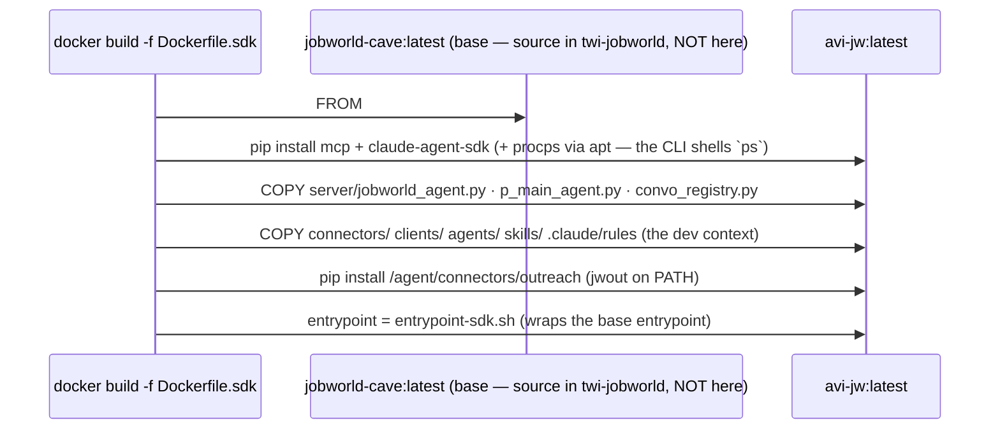
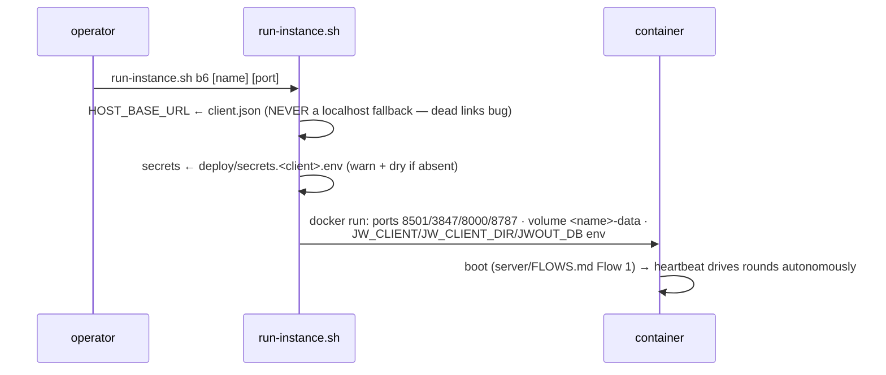

# `deploy/` — build + run flows (rule 22)

## Flow 1 — Image build



## Flow 2 — Production run (`run-instance.sh <client>`)



## Flow 3 — The mock harness (`run-mock-instance.sh`) — S2+S3 with S1 faked

```mermaid
sequenceDiagram
  participant O as operator / CI
  participant R as run-mock-instance.sh
  participant C as b6-mock container
  participant CEO as CEO
  O->>R: deploy/run-mock-instance.sh
  R->>R: MINIMAX_API_KEY ← ~/system_config.sh (canonical; heaven's mechanism)<br/>JWOUT_MOCK=1 · JW_CLIENT=b6mock · NO live creds
  R->>C: docker run (same shape as Flow 2, mock env)
  R->>C: wait /api/health → POST /input ← campaign-trigger.md<br/>(trigger reads $JW_CLIENT — never hard-codes a client)
  C->>CEO: first boot → round (skills/FLOWS.md) with mocked verbs
  O->>C: watch: docker logs · :8787 funnel · :8511 terminal ·<br/>/api/org-chart · events.jsonl · agent transcripts
  Note over O: PASS assertions in rule 06. Wipe: docker rm -f + volume rm.
```

## Planned (rule 08): CEO provider/model switch

`CEO_PROVIDER=minimax|anthropic` + `DEFAULT_CLAUDE_CODE_MODEL` (e.g.
`claude-sonnet-5`): p_main_agent's `_provider_env()` already falls back to
os.environ auth when no MiniMax token is injected — the switch is env wiring in
these run scripts + an interface relaunch button, no agent-code change.
