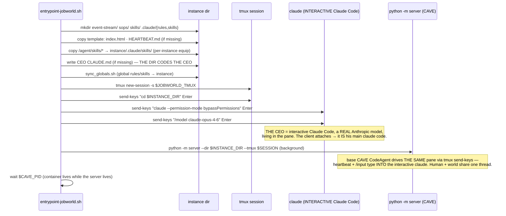

# `docker/` — the BASE image flows (rule 22)

This dir IS the base image's source (`jobworld-cave:latest` builds from
`Dockerfile.jobworld`): the base boot, the template copy, the global sync.
**This is where the tmux-CEO architecture lives** — the version truth.

## Flow 1 — Base boot (`entrypoint-jobworld.sh`) — THE ORIGINAL DESIGN



## Flow 2 — What the SDK overlay (`Dockerfile.sdk` + `entrypoint-sdk.sh`) changes

```mermaid
sequenceDiagram
  participant W as entrypoint-sdk.sh (overlay wrapper, root)
  participant B as entrypoint-jobworld.sh (base, as ceo)
  participant JA as JobworldAgent.__init__ (patched)
  W->>W: chown data dirs · start jwout serve + dashboard sidecars
  W->>B: su ceo → exec base entrypoint UNCHANGED
  B->>B: Flow 1 runs — INCLUDING the tmux claude launch
  B->>JA: python -m server ...
  JA->>JA: super() attaches tmux CodeAgent → then REPLACED by ClaudePMainAgent (SDK)
  Note over JA: the pane's interactive claude is ORPHANED in this mode —<br/>heartbeat//input drive the SDK session, not the pane.<br/>SDK = the dev/mock harness; the tmux pane = the production surface (rule 07).
```

## Files

| file | role |
|---|---|
| `Dockerfile.jobworld` | builds `jobworld-cave:latest` (CAVE + server + ink-ceo + template) |
| `entrypoint-jobworld.sh` | Flow 1 — the base boot |
| `sync_globals.sh` | global `/jobworld_data/.claude/` rules/skills → instance |
| `bake_jobworld.sh` | image bake helper |
| `requirements-jobworld.txt` | base python deps |
