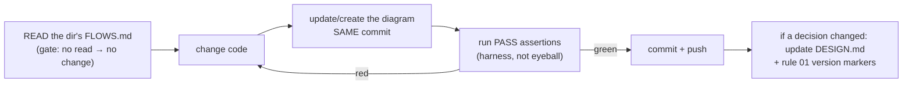

# *World Spine — AIOS Design (the `.claude` dir of the spine's dev repo)

> **Status: DRAFT v0.2 — Fable, 2026-07-03.** Companion to `WORLD-SPINE-LLD.md`.
> **REVISED by the module decision (LLD §0): there is NO new spine repo.** The
> jobworld module lands in cave-teams; client packs stay in avi-jw. So this AIOS
> design applies as EXTENSIONS to the two existing dev dirs, not a new tree:
> **cave-teams** gets the rules/harness below scoped to the jobworld module
> (its `.claude/` already has CLAUDE.md + LAWS.md — extend, don't replace);
> **avi-jw** already carries rules 00–08 + FLOWS.md discipline (keep current).
> The §1 tree below is retained as the CHECKLIST of pieces to place, with
> `spine/` → `cave_teams/` modules and `worldpacks/` → `avi-jw/worldpacks/`.
> THE DIRECTORY CODES THE AGENT — so the dirs are designed like code.

## 0. Design principles (why each piece exists)

1. **The dir is the loadout** (flat-vs-tree law): identity + rules + skills equip
   on entry; nothing load-bearing lives only in a human's head or a chat log.
2. **Rules are scaffold; scripts are harness** (rule 24): every MUST in a rule
   gets a check script; the check, not the prose, is the constraint.
3. **Progressive disclosure**: the root loads small (identity + laws + map);
   depth loads on descent (each module dir carries its own FLOWS.md + rules).
4. **Diagrams are load-bearing** (rules 22/23): no code change without reading
   that dir's FLOWS.md; every change updates the diagram in the same commit.
5. **This context ships**: the AIOS is packaged INTO the dev image / repo so
   every future session — human-driven or scheduled — boots with it (Isaac:
   "this dev context should be baked into the image").

## 1. The dir tree (the deliverable — build exactly this)

```
<spine-repo>/                        # canonical dir: NAME PENDING (Isaac)
├── CLAUDE.md                        # identity: the Spine Engineer (§2)
├── DESIGN.md                        # = WORLD-SPINE-LLD.md, moved here (rule 26)
├── .claude/
│   ├── rules/
│   │   ├── 00-WHAT-THIS-IS.md       # the mission + the one law + READ ORDER
│   │   ├── 01-ARCHITECTURE.md       # component diagram + version markers (CURRENT/SUPERSEDED)
│   │   ├── 02-DEV-FLOW.md           # THE flow: read FLOWS.md → change → update diagram → PASS → commit+push
│   │   ├── 03-SEAMS-ARE-FROZEN.md   # the §3 contracts verbatim; changing one = LLD PR first
│   │   ├── 04-VERIFICATION.md       # PASS assertions per module + the mock-world harness
│   │   ├── 05-AUTONOMY-BRIDGE.md    # pointer-rule → avi-jw rule 05 (theory carried by cave-teams)
│   │   └── 06-PROFILES-AND-AUTH.md  # Max/OAuth/one-login model + per-agent provider config
│   └── skills/
│       ├── understand-*/            # the teaching pack, COPIED (advanced-cc, subagents, teams, skills, claude-md, hooks)
│       ├── run-mock-world/          # boot a world on the mock profile + trigger a round (harness entry)
│       ├── verify-round/            # the PASS-assertion checker (reads run evidence, not vibes)
│       └── goldenize-round/         # promote a proven round → .cave/golden + register()
├── spine/                           # the code (each dir: FLOWS.md + focused modules)
│   ├── runtimes/                    #   TmuxClaudeRuntime · SDKClaudeRuntime · (heaven adapters)
│   ├── worldpack/                   #   schema, loader, validator (world.json + dirs)
│   ├── launch/                      #   OM launch_team tool · heartbeat automation wiring
│   └── harness/                     #   mock-world runner · assertion scripts · monitors
├── worldpacks/
│   └── b6/                          # the paying instance (clients/ verbatim from avi-jw)
└── scripts/
    ├── check-flows.sh               # HARNESS: changed code dir ⇒ its FLOWS.md changed too (pre-commit)
    ├── check-seams.sh               # HARNESS: seam signatures match rule 03 verbatim
    └── check-rules-current.sh       # HARNESS: rule 01 diagram mentions every top-level module
```

## 2. CLAUDE.md — the identity (spec, not final prose)

- **You are the Spine Engineer.** You build the *World spine (OM + cave-teams +
  CAVE + world-packs). You are not the CEO, not a world agent — you build the
  thing that runs them.
- **Read order on entry**: rules 00 → 01 → 02; DESIGN.md §1–3 before ANY code.
- **The one law** (inherited): code only for what MUST execute; instructions for
  everything an LLM can do by generating. (Worker-binding spectrum, rule 05.)
- **Never wing a connection** — find + mirror the canonical impl (cave-teams
  runner.py, CAVE agent.py, OM runtime.py are the references; paths listed).
- **Facts that burned us** (carried forward so they never re-burn): bundled CLI
  needs `procps`; SDK turns need a turn-lock (no concurrent resume of one
  session); `claude` in tmux needs auth BEFORE first send; Read-tool-not-cat
  for loadout injection; message FILES are the payload, pane text is liveness.

## 3. Rule 02 — THE dev flow (the whole discipline in one loop)



Enforced by `scripts/check-flows.sh` as a pre-commit hook (rule 24: the script
is the constraint; the prose is the explanation).

## 4. Rule 04 — PASS assertions (per LLD module; mechanical, evidence-based)

| module | PASS assertion (checked by verify-round / scripts) |
|---|---|
| runtimes/TmuxClaudeRuntime | `send_and_wait` returns; teammate's message FILE exists in session inbox; transcript path captured |
| runtimes/SDKClaudeRuntime | turn executes on OAuth (no key env); turn-lock holds under concurrent send |
| worldpack loader | b6 pack validates; a gate-open client BLOCKS delivery dispatch (condition fires) |
| launch/launch_team | OM tool call → ephemeral server up → round runs → server torn down; report returned |
| the JW round (golden) | 5 dept dirs each show THEIR skill in THEIR transcript; funnel rows written by dept agents; supposedly_done → leader review → complete |
| heartbeat | automation fires a decision cycle; grade-1 client: delivery still held without human QA |

## 5. What the agent in the dir may NOT do (the negative space)

- No new abstractions when a cave-teams/CAVE/OM primitive exists (reuse-first;
  the THE-ONLY-SOURCE-OF-TRUTH failure mode was exactly this).
- No seam changes without a DESIGN.md update in the same PR (rule 03 harness).
- No "verified" claims without the harness evidence path (rule 04 tables).
- No MiniMax/heaven assumptions in Profile-A paths (auth model, rule 06).
- No writes outside the spine repo + its worldpacks (canonical-dirs law).

## 6. Packaging (Isaac: "baked into the image")

The dev image (and any hosted dev box) COPIES this `.claude/` + CLAUDE.md +
DESIGN.md in at build time — a fresh session on any machine boots as the Spine
Engineer with the full context, no archaeology. Same mechanism as the JW
entrypoint's skill-copy, applied to the dev context itself.

## 7. Bootstrap order for the non-Fable weeks

1. Isaac names the canonical dir → `git init`, move LLD → DESIGN.md, build §1 tree.
2. `scripts/check-*.sh` FIRST (the harness before the code it guards).
3. runtimes/ (TmuxClaudeRuntime spike → PASS) → worldpack/ → launch/ → golden round.
4. b6 worldpack parity vs current-JW mock evidence → fallback decision (~07-14).
