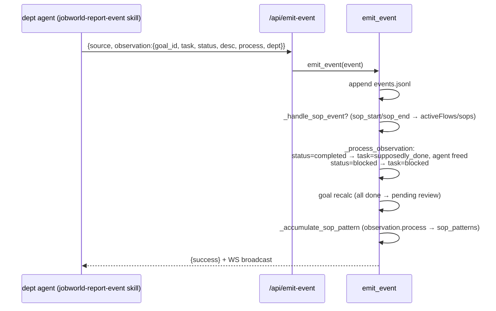
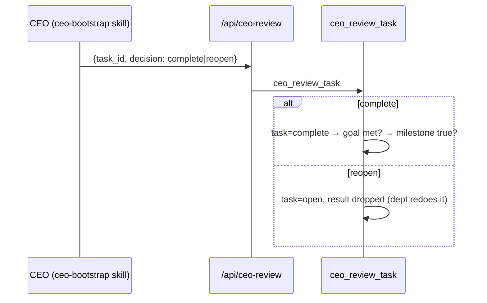

# `server/` — execution-boundary flows (rule 22)

Sequence diagrams for every boundary this layer owns. Component context: rule
`07-ARCHITECTURE.md`. Files: `jobworld_agent.py` (the world), `jobworld_server.py`
(HTTP surface), `../p_main_agent.py` (the SDK CEO — root-level; modularization
TODO in rule 08).

## Flow 1 — Boot (container → serving world)

```mermaid
sequenceDiagram
  participant D as docker run
  participant E1 as entrypoint-sdk.sh (root)
  participant E2 as entrypoint-jobworld.sh (base, as ceo)
  participant JA as JobworldAgent.__init__
  participant CEO as ClaudePMainAgent
  D->>E1: start
  E1->>E1: mkdir /jobworld_data + chown ceo<br/>copy /agent/agents → instance/agents<br/>start jwout serve (:8000) + dashboard (:8787)
  E1->>E2: su ceo → exec
  E2->>E2: tmux new-session -s ceo (the pane; PRODUCTION surface)
  E2->>JA: python -m server --dir <instance> --port 3847 --tmux ceo
  JA->>JA: load data.json → store; CAVEAgent super() attaches tmux CodeAgent
  JA->>CEO: REPLACE main_agent = ClaudePMainAgent(alias=ceo,<br/>cwd=instance, persona=agents/CEO.md, plugins=[])
  Note over CEO: p_main_agent.py:98-107 — the SDK swap.<br/>tmux pane stays bare in this mode (known: rule 07 version markers)
  JA->>JA: _wire_ceo_heartbeat (Tick every 30s)
  JA-->>D: uvicorn on :3847 — world serving
```

## Flow 2 — One CEO turn (`POST /input`)

```mermaid
sequenceDiagram
  participant C as caller (dashboard chat / harness / human)
  participant S as jobworld_server /input
  participant M as ClaudePMainAgent
  participant SDK as claude_agent_sdk.query
  participant CLI as bundled claude subprocess
  C->>S: POST /input {text}
  S->>S: last_input_at = now (heartbeat idle clock)
  S->>M: send_keys(text) → buffer; send_keys("Enter") → flush
  M->>M: _run_turn: resume_id = registry.resume(alias)
  M->>SDK: asyncio.run(query(prompt, options))
  Note over SDK: options: cwd=instance · setting_sources=["project"]<br/>model=DEFAULT_CLAUDE_CODE_MODEL · env=_provider_env()<br/>(MiniMax if MINIMAX_API_KEY set, else os.environ auth)
  SDK->>CLI: spawn (NEEDS procps in image — CLI shells `ps` mid-turn)
  loop stream
    CLI-->>M: Assistant/User/Result messages
    M-->>S: on_event → broadcast → /ws (dashboard live view)
  end
  M->>M: registry.touch_active(new session_id); transcript append
  M-->>S: final text
  S-->>C: {sent:true}
```

## Flow 3 — Heartbeat (the autonomy pulse)

```mermaid
sequenceDiagram
  participant H as Heart Tick (every 30s)
  participant JA as JobworldAgent
  participant M as main_agent
  H->>JA: _ceo_heartbeat_tick()
  JA->>JA: idle = now − max(last_input_at, last_heartbeat)
  alt idle < 300s
    JA-->>H: return (someone is driving; stay quiet)
  else idle ≥ 300s
    JA->>JA: prompt = HEARTBEAT.md (else default: supposedly_done + open counts)
    JA->>M: send_keys(prompt, Enter) — SAME path as Flow 2
    Note over M: KNOWN BUG (SDK mode): can overlap a still-running turn →<br/>two turns resume one session (fork). Fix = turn lock. Rule 08.
  end
```

## Flow 4 — Department report (`POST /api/emit-event`)



## Flow 5 — CEO review (`POST /api/ceo-review`)



## Flow 6 — SOP harvest (pattern → skill)

```mermaid
sequenceDiagram
  participant CEO as CEO (decides a pattern is PROVEN — the goldenize gate)
  participant JA as harvest_sop(pattern_key)
  CEO->>JA: harvest
  JA->>JA: scope = depts_involved × agents_involved<br/>1 dept+1 agent → agent-sop skill<br/>1 dept+N → run-dept-<d>/resources/<br/>N depts → <company>-sops/
  JA->>JA: write SKILL.md from pattern steps; mark harvested
  Note over JA: harvest emits PROSE today. Planned: emit a golden<br/>cave-teams config instead (rule 08 · the cave-teams track).
```
