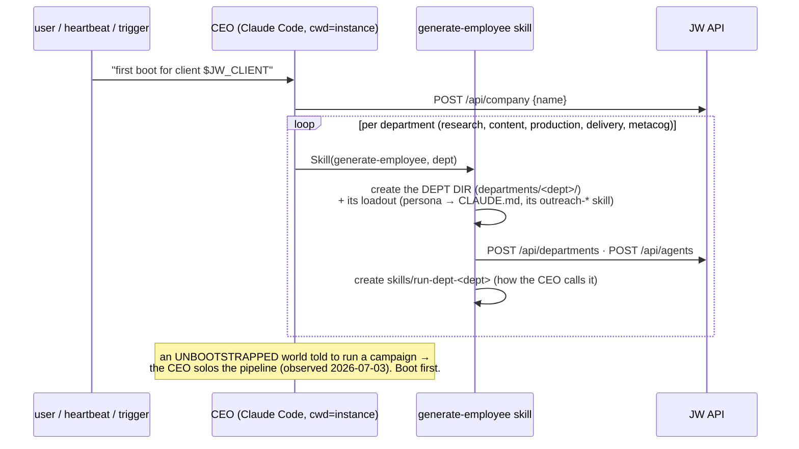

# `skills/` — the round flows (rule 22)

The skills are the S2 control flow — procedures the CEO and departments follow.
DEPARTMENT IS A DIRECTORY: calling a department = running an agent process in its
dir, which equips that dir's loadout (CLAUDE.md + .claude/*). See rule 06.

## Flow 1 — FIRST BOOT (empty world → staffed company)



## Flow 2 — The round loop (run-outreach-campaign × ceo-bootstrap)

```mermaid
sequenceDiagram
  participant HB as heartbeat / user
  participant CEO as CEO
  participant CL as clients/$JW_CLIENT
  participant D as dept agent (process IN departments/<dept>/)
  participant JW as jwout (mocked when JWOUT_MOCK=1)
  participant API as JW API
  HB->>CEO: decision cycle
  CEO->>API: GET /api/tasks/supposedly-done → review each (Flow 5, server)
  CEO->>CL: read client.json → GATE CHECK (clients/FLOWS.md)
  alt gates open
    CEO->>API: emit outreach_gate_blocker events; write GATES.md; HOLD delivery
  else gates clear (b6mock always)
    CEO->>API: POST project/milestone/goal/tasks (one per dept stage)
    loop per dept stage: research → content → production → delivery → metacog
      CEO->>D: CALL dept — agent process in departments/<dept>/
      D->>D: its loadout equips → runs ITS outreach-* skill<br/>applying clients/$JW_CLIENT instructions
      D->>JW: connector verbs (pull/qualify/write=LLM/page/send/track/reply/report)
      D->>API: jobworld-report-event → task supposedly_done
    end
    CEO->>API: review → complete; metacog verdict vs client success thresholds
  end
  Note over CEO,D: PASS = each dept's OWN transcript shows ITS skill.<br/>CEO doing dept work inline = the degenerate mode.
```
