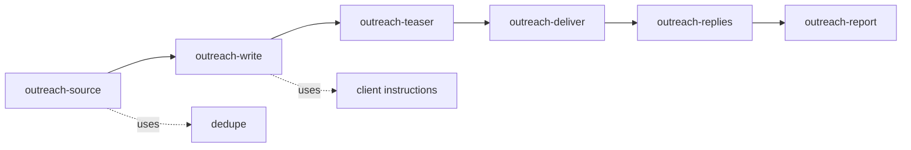

# Rule — the outreach skill family

**Why these skill dirs exist.** `skills/` holds JW infra skills (ceo-bootstrap,
generate-employee, the understand-* set). The `outreach-*` dirs are the **worker
procedures** for the outreach process — the SKILL layer of the worker-layer
architecture (`../.claude/rules/00-WORKER-LAYER-ARCHITECTURE.md`).

A skill here is a **procedure**, not a function. It tells a worker: which
`connectors/outreach` (`jwout`) verbs to run, in what order, applying which
`clients/<name>` instructions. Deterministic steps = connector verbs.
Generative steps = the LLM applying client instructions (no code).

## Runtime contract (every outreach skill assumes)

| env | meaning |
|---|---|
| `JW_CLIENT` | client name, e.g. `b6` |
| `JW_CLIENT_DIR` | absolute path to `clients/<JW_CLIENT>` |
| `jwout` | the connector console script on PATH (install: `connectors/outreach`) |
| `JWOUT_DB` | the outreach SQLite DB for this client/run |
| secrets | SMTP/IMAP/API keys loaded per `client.json.env_profile` (deployment) |

## Orchestration (above the stages)

`run-outreach-campaign` is the CEO-level skill that sequences the five
departments across a batch for one client, respecting the client's gates. The
six stage skills below are the per-stage procedures it drives.

## The family (one skill per pipeline stage; maps to the bijection)

| skill | stage | connector verbs | client instructions used |
|---|---|---|---|
| `outreach-source` | find leads | `jwout pull` | `client.json.targeting`, `dedupe/` |
| `outreach-qualify` | score ICP fit | `jwout qualify set` | `icp.md` (the rubric) |
| `outreach-write` | write copy | *(none — pure instruction)* | `positioning.md`, `template.md`, `assets.md` |
| `outreach-teaser` | make + host clip | `jwout video`, `jwout host` | `template.md` video rules, `assets.md` colors/world |
| `outreach-deliver` | send + record | `jwout send`, `jwout track event` | `client.json` from/reply/variant/cohort, CAN-SPAM footer |
| `outreach-replies` | read + classify replies | `jwout reply`, `jwout track event` | — (LLM classifies) |
| `outreach-report` | measure | `jwout track report` | `client.json.cost_per_send_usd`, `success` |

## Department mapping (which worker runs which skill)

See `../agents/` and `../.claude/rules/01-DEPARTMENTS.md`. Source→Research dept,
Write→Content dept, Teaser→Production dept, Deliver+Replies→Delivery dept,
Report→Metacog dept.
