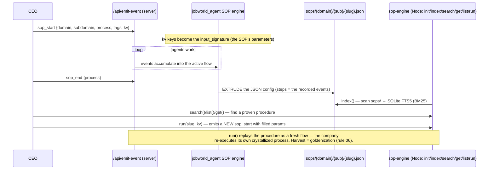

# `sop-engine/` — SOP lifecycle flows (rule 22)

Standalone Node library (cli.js + sop-engine.js + sops.db). **Referenced by no
Python/shell in this repo today** — it is the search/run layer over the SOPs the
server extrudes; skill integration is future work (per its own header).

## Flow — SOP lifecycle (record → extrude → index → run)

Two SOP paths coexist in the server (see `server/FLOWS.md` Flow 4/6): the
legacy `sop_start`/`sop_end` extrusion (this engine's input) and pattern
accumulation → `harvest_sop` → SKILL.md. Convergence is a rule-08 topic.
